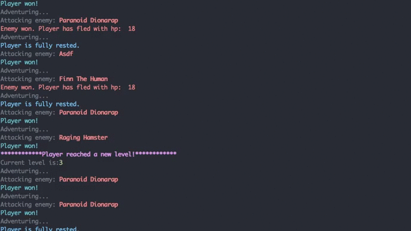

[](https://coveralls.io/github/Skarlso/goprogressquest?branch=master) [](https://travis-ci.org/Skarlso/goprogressquest)

Go Progress Quest
=================

This will be a Go Implementation of the famous type of RPG, called:
https://en.wikipedia.org/wiki/Progress_Quest

See it in action here:



This will be an API which can be consumed by any client in a number of ways.

CLI Front-End for Go Progress Quest
-----------------------------------

This is a very basic, semi interactive CLI front-end for this project:

[GoProgressQuest Front-End](https://github.com/Skarlso/goprogressfrontend)

Example usage
-------------

```bash
curl -H "Content-type: application/json" -X POST -d '{"name":"awesome"}' http://localhost:8989/api/1/create
curl -H "Content-type: application/json" -X POST -d '{"name":"awesome"}' http://localhost:8989/api/1/start
```

This will start adventuring for character ```awesome```. Multiple characters can be sent adventuring. But after a while the log will be unreadable. Later, I might create a web front-end for this project which will be able to track multiple characters at once.

And once you think your character adventured enough, simply call stop.

```bash
curl -H "Content-type: application/json" -X POST -d '{"name":"awesome"}' http://localhost:8989/api/1/stop
```

Installing
==========

GoProgressQuest uses mongodb for it's back-end storage. The storage medium is interfaced, so any kind of database can be plugged in and used if you implement these three functions:

```go
// Storage defines a storage medium. It could be anything that implements this interface.
type Storage interface {
	Save(Character) error
	Load(string) (Character, error)
	Update(Character) error
}
```

API
===

API Version is 1
----------------

/api/1/*

The following end-points are available:

Creational
----------

```
/
```
Currently returns:
```json
{
    "message":"Welcome!"
}
```

```bash
# Character names don't have to be unique
/create
```
```json
POST:
{
    "name":"MyAwesomeCharacterName"
}
```
Return:
```json
{
    "name":"MyAwesomeCharacterName"
}
```

```bash
# Load a character by ID since names are not unique at the moment
/load/{ID}
/load/3da541559918a808c2402bba5012f6c60b27661c
```

Return:
```json
{
    "Inventory":{"Items":[]},"Name":"MyAwesomeCharacterName","Stats":{"Str":0,"Agi":0,"In":0,"Per":0,"Chr":0,"Lck":0},"ID":"3da541559918a808c2402bba5012f6c60b27661c","Gold":0
}
```

Adventuring related
-------------------

```bash
# Start adventuring
/start
```

```json
POST:
{
    "name":"MyAwesomeCharacterName"
}
```
Return:
```json
{
    "message":"Started adventuring for character: MyAwesomeCharacterName"
}
```

```bash
# Stop adventuring
/stop
```
```json
POST:
{
    "name":"MyAwesomeCharacterName"
}
```
Return:
```json
{
    "message":"Stopped adventuring for character: MyAwesomeCharacterName"
}
```

Running it
----------

```bash
go build
```

Currently the project is simple enough so that no Makefile is needed for this process.

Dependencies
------------

This project uses [Glide](https://github.com/Masterminds/glide) as its package handler. Please add vendor and glide.lock to your ignore files. The project should always work with the latest versions.
